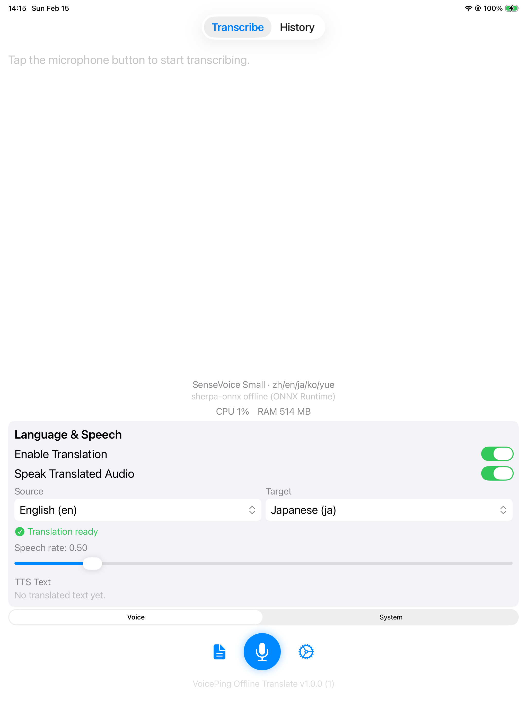
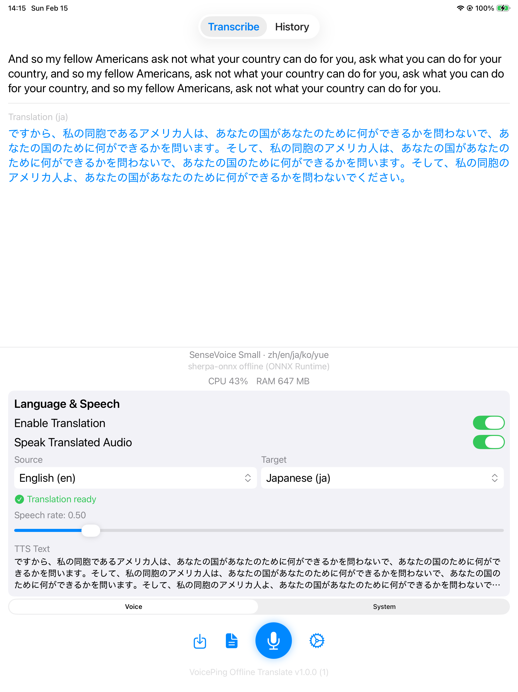
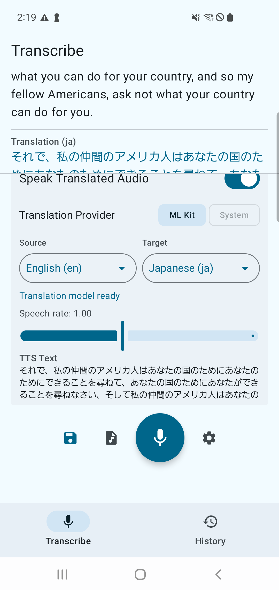
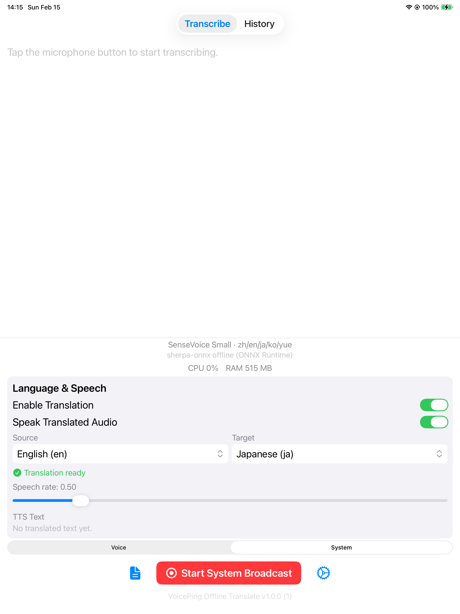

# iOS + Android Offline Speech Translation

Cross-platform offline speech app with transcription, translation, TTS, and history/export flows.
This repository currently ships a focused model set per platform.

### iOS (iPad Pro 3rd gen)

| Home | Transcription + Translation | Demo |
|---|---|---|
|  |  | <a href="docs/demos/ios-file-transcription-demo.mp4"></a> |

> SenseVoice Small with Apple Translation (English → Japanese) and TTS. Full video: [MP4](docs/demos/ios-file-transcription-demo.mp4).

### Android

| Transcription + Translation | Demo |
|---|---|
|  | <a href="docs/demos/android_speech_translation_demo.mp4"></a> |

> SenseVoice Small with ML Kit Translation and TTS. Full video: [MP4](docs/demos/android_speech_translation_demo.mp4).

## Current Scope (Code-Accurate)

### iOS app (`OfflineTranscription`)

- ASR models: `SenseVoice Small`, `Parakeet TDT 0.6B`, and `Apple Speech`.
- Audio source switching:
- `Voice` (microphone)
- `System` (ReplayKit Broadcast Upload Extension)
- Translation: Apple Translation framework bridge (`iOS 18+`).
- TTS: `AVSpeechSynthesizer` (`NativeTTSService`).
- History/details/export:
- SwiftData model (`TranscriptionRecord`)
- audio session files + ZIP export (`SessionFileManager`, `ZIPExporter`)

### Android app (`VoicePingIOSAndroidOfflineSpeechTranslationAndroid`)

- ASR models: `SenseVoice Small`, `Parakeet TDT 0.6B`, `Android Speech (Offline)`, `Android Speech (Online)`.
- Audio source switching:
- `Voice` (microphone)
- `System` (MediaProjection playback capture)
- Translation providers:
- ML Kit offline
- Android system translation (`API 31+`) via `AndroidSystemTranslator`
- TTS: `AndroidTtsService` (`TextToSpeech`).
- History/details/export:
- Room (`TranscriptionEntity`, `AppDatabase`)
- playback + waveform + ZIP export (`AudioPlaybackManager`, `SessionExporter`)

## Supported Models

### iOS (`OfflineTranscription/Models/ModelInfo.swift`)

| Model ID | Engine | Languages |
|---|---|---|
| [`sensevoice-small`](https://huggingface.co/FunAudioLLM/SenseVoiceSmall) | sherpa-onnx offline | `zh/en/ja/ko/yue` |
| [`parakeet-tdt-v3`](https://huggingface.co/nvidia/parakeet-tdt-0.6b-v3) | sherpa-onnx offline (transducer) | `25 European languages` |
| [`apple-speech`](https://developer.apple.com/documentation/speech/sfspeechrecognizer) | SFSpeechRecognizer | `50+ languages` |

### Android (`.../model/ModelInfo.kt`)

| Model ID | Engine | Languages |
|---|---|---|
| [`sensevoice-small`](https://huggingface.co/FunAudioLLM/SenseVoiceSmall) | sherpa-onnx offline | `zh/en/ja/ko/yue` |
| [`parakeet-tdt-v3`](https://huggingface.co/nvidia/parakeet-tdt-0.6b-v3) | sherpa-onnx offline (transducer) | `25 European languages` |
| `android-speech-offline` | Android SpeechRecognizer (on-device, API 31+) | `System languages` |
| `android-speech-online` | Android SpeechRecognizer (standard recognizer) | `System languages` |

## System Audio Capture

Both platforms support transcribing audio from other apps (music, video calls, etc.)
in addition to microphone input. The user switches between **Voice** and **System** modes
with a segmented control / chip selector above the record button.



> iOS System mode — the red **Start System Broadcast** button replaces the mic button when System is selected.

### iOS — ReplayKit Broadcast Upload Extension

iOS uses a [Broadcast Upload Extension](https://developer.apple.com/documentation/replaykit/rpbroadcastsamplehandler)
to capture system audio digitally from any app.

**How it works:**

1. User taps the **Start System Broadcast** button (`RPSystemBroadcastPickerView`).
2. iOS presents the system broadcast picker; the user selects the extension.
3. `SampleHandler` (in `BroadcastUploadExtension/`) receives `.audioApp` sample buffers.
4. Audio is converted to mono Float32 at 16 kHz and written to a **shared memory-mapped ring buffer**
   in the App Group container (`group.com.voiceping.translate`).
5. The main app's `SystemAudioSource` reads from the ring buffer and feeds samples
   to the ASR engine, transparently replacing the microphone path.

```
┌──────────────────────────┐      Darwin notify       ┌─────────────────────────┐
│  Broadcast Upload Ext.   │  ──────────────────────▶  │      Main App           │
│  SampleHandler.swift     │                           │  SystemAudioSource       │
│                          │   Shared Ring Buffer      │  WhisperService          │
│  CMSampleBuffer → F32    │  ◀─────────────────────▶  │  → ASR Engine            │
│  16 kHz mono             │   (~1.88 MB mmap file)    │  → Translation / TTS     │
└──────────────────────────┘                           └─────────────────────────┘
```

| File | Role |
|------|------|
| `BroadcastUploadExtension/SampleHandler.swift` | Receives system audio, resamples to 16 kHz mono, writes to ring buffer |
| `Shared/SharedAudioRingBuffer.swift` | Lock-free SPSC ring buffer over memory-mapped file (480k samples, ~30 s) |
| `OfflineTranscription/Services/SystemAudioSource.swift` | Reads ring buffer, exposes samples to WhisperService |
| `OfflineTranscription/Views/BroadcastPickerView.swift` | `RPSystemBroadcastPickerView` wrapped as SwiftUI view |

### Android — MediaProjection Playback Capture

Android uses the [AudioPlaybackCapture API](https://developer.android.com/guide/topics/media/playback-capture)
(API 29+) via `MediaProjection` to capture audio playing from other apps.

**How it works:**

1. User selects the **System** chip in the audio source card.
2. On first use, the app starts `MediaProjectionService` (foreground service) and requests
   `MediaProjectionManager.createScreenCaptureIntent()` permission.
3. `AudioRecorder.createSystemPlaybackAudioRecord()` builds an `AudioRecord` with
   `AudioPlaybackCaptureConfiguration` capturing `USAGE_MEDIA`, `USAGE_GAME`, and `USAGE_UNKNOWN`.
4. PCM 16-bit audio at 16 kHz is read in 100 ms chunks, normalized to `[-1, 1]` floats,
   and fed to the ASR engine through the same recording pipeline as the microphone path.

```
┌──────────────────────────┐   Foreground Service      ┌─────────────────────────┐
│  MediaProjectionService  │   (holds projection)      │  AudioRecorder          │
│  (notification visible)  │ ───────────────────────▶  │  AudioPlaybackCapture   │
└──────────────────────────┘                           │  → PCM 16kHz mono       │
                                                       │  → WhisperEngine        │
                                                       │  → Translation / TTS    │
                                                       └─────────────────────────┘
```

| File | Role |
|------|------|
| `.../service/MediaProjectionService.kt` | Foreground service holding MediaProjection permission (Android 14+ requirement) |
| `.../service/AudioRecorder.kt` | Creates `AudioRecord` with playback capture config; reads PCM chunks |
| `.../model/AudioInputMode.kt` | `MICROPHONE` / `SYSTEM_PLAYBACK` enum |
| `.../ui/transcription/TranscriptionScreen.kt` | `AudioInputModeCard` — chip selector + permission launcher flow |

## Architecture

### iOS

- Orchestrator: `OfflineTranscription/Services/WhisperService.swift`
- Engines:
- `SherpaOnnxOfflineEngine`
- `AppleSpeechEngine`
- Translation: `AppleTranslationService`
- TTS: `NativeTTSService`
- Persistence/export: SwiftData + `SessionFileManager` + `ZIPExporter`

### Android

- Orchestrator: `.../service/WhisperEngine.kt`
- Engines:
- `SherpaOnnxEngine`
- `AndroidSpeechEngine`
- Translation:
- `MlKitTranslator`
- `AndroidSystemTranslator`
- TTS: `AndroidTtsService`
- Persistence/export: Room + `AudioPlaybackManager` + `SessionExporter`

## Requirements

### iOS

- Xcode 15+
- iOS 17+
- `xcodegen`

### Android

- JDK 17
- Android SDK 35
- Android 8.0+ (`minSdk 26`)

## Setup

### iOS

```bash
git clone --recurse-submodules <repo-url>
cd ios-android-offline-speech-translation
scripts/setup-ios-deps.sh
scripts/generate-ios-project.sh
open VoicePingIOSAndroidOfflineSpeechTranslation.xcodeproj
```

### Android

```bash
cd VoicePingIOSAndroidOfflineSpeechTranslationAndroid
./setup-deps.sh
./gradlew assembleDebug
```

## Tests and Automation

```bash
# iOS
scripts/ci-ios-unit-test.sh
scripts/ios-e2e-test.sh
scripts/ios-ui-flow-tests.sh

# Android
scripts/ci-android-unit-test.sh
scripts/android-e2e-test.sh
scripts/android-userflow-test.sh
```

## Privacy

- Runtime transcription/translation/TTS are local on device.
- Network access is for model/language pack downloads and dependency setup.

## License

Apache License 2.0. See `LICENSE`.

<!-- BENCHMARK_RESULTS_START -->
### Inference Token Speed Benchmarks

Measured from E2E `result.json` files using a longer English fixture.

Fixture: `artifacts/benchmarks/long_en_eval.wav` (30.00s, 16kHz mono WAV)

#### Evaluation Method

- Per-model E2E runs with the same English fixture on each platform.
- `duration_sec = duration_ms / 1000` from each model `result.json`.
- `Words` is computed from transcript words: `[A-Za-z0-9']+`.
- `tok/s` uses `tokens_per_second` from `result.json` when present; otherwise `Words / duration_sec`.
- `RTF = duration_sec / audio_duration_sec`.

#### iOS Graph


#### iOS Results

| Model | Engine | Words | Inference (ms) | Tok/s | RTF | Result |
|---|---|---:|---:|---:|---:|---|
| `sensevoice-small` | sherpa-onnx offline (ONNX Runtime) | 58 | 2458 | 23.59 | 0.08 | PASS |
| `apple-speech` | - | 0 | n/a | n/a | n/a | SKIP |
| `parakeet-tdt-v3` | - | 0 | n/a | n/a | n/a | SKIP |

#### Android Graph


#### Android Results

| Model | Engine | Words | Inference (ms) | Tok/s | RTF | Result |
|---|---|---:|---:|---:|---:|---|
| `sensevoice-small` | sherpa-onnx offline (ONNX Runtime) | 58 | 1725 | 33.63 | 0.06 | PASS |
| `parakeet-tdt-v3` | sherpa-onnx offline (ONNX Runtime) | 58 | 2928 | 19.81 | 0.10 | PASS |
| `android-speech-offline` | - | 0 | n/a | n/a | n/a | SKIP |
| `android-speech-online` | - | 0 | n/a | n/a | n/a | SKIP |

#### Reproduce

1. `rm -rf artifacts/e2e/ios/* artifacts/e2e/android/*`
2. `TARGET_SECONDS=30 scripts/prepare-long-eval-audio.sh`
3. `EVAL_WAV_PATH=artifacts/benchmarks/long_en_eval.wav scripts/ios-e2e-test.sh`
4. `INSTRUMENT_TIMEOUT_SEC=300 EVAL_WAV_PATH=artifacts/benchmarks/long_en_eval.wav scripts/android-e2e-test.sh`
5. `python3 scripts/generate-inference-report.py --audio artifacts/benchmarks/long_en_eval.wav --update-readme`

One-command runner: `TARGET_SECONDS=30 scripts/run-inference-benchmarks.sh`

<!-- BENCHMARK_RESULTS_END -->
